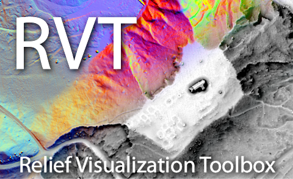

# QGIS Plugin for Relief Visualization Toolbox



Relief Visualization Toolbox was produced to help scientist visualize raster elevation model datasets. We have narrowed down the selection to include techniques that have proven to be effective for identification of small scale features. Default settings therefore assume working with high resolution digital elevation models, derived from airborne laser scanning missions (lidar).

## Installation

Create a ZIP file from the repository and install it via standard QGIS Plugin installation method and select install from ZIP. See [QGIS Plugins — QGIS Documentation documentation](http://docs.qgis.org/latest/en/docs/user_manual/plugins/plugins.html).

Later, you can also just update the files located in your Plugins folder. It is located under QGIS profiles, e.g.:
```
C:/Users/UserName/AppData/Roaming/QGIS/QGIS3/profiles/default/python/plugins
```

The plugin has been tested under QGIS 3.12 and later.

## Documentation

Documentation of the plugin is under development.

Use the RVT Python documentation, availabe at [Read the Docs](https://rvt-py.readthedocs.io/).

## References

When using the tools, please cite:

*   Kokalj, Ž., Somrak, M. 2019. Why Not a Single Image? Combining Visualizations to Facilitate Fieldwork and On-Screen Mapping. Remote Sensing 11(7): 747.
*   Zakšek, K., Oštir, K., Kokalj, Ž. 2011. Sky-View Factor as a Relief Visualization Technique. Remote Sensing 3: 398-415.
*   Kokalj, Ž., Zakšek, K., Oštir, K. 2011. Application of Sky-View Factor for the Visualization of Historic Landscape Features in Lidar-Derived Relief Models. Antiquity 85, 327: 263-273.

## Contributing
Pull requests are welcome. For major changes, please open an issue first to discuss what you would like to change.

Please report any bugs and suggestions for improvements.

## Acknowledgment

Development of RVT was part financed by the European Commission's Culture Programme through the ArchaeoLandscapes Europe project and by the Slovenian Research Agency core funding No. P2-0406, and by research projects No. J6-7085 and No. J6-9395.

## License
This project is licensed under the terms of the [Apache License](LICENSE).

