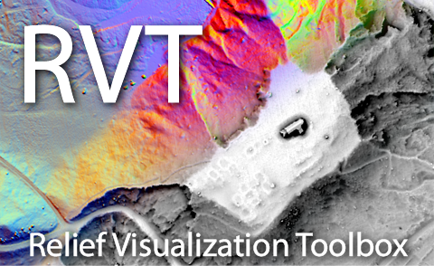

# Relief Visualization Toolbox QGIS Plugin



Relief Visualization Toolbox was produced to help scientist visualize raster elevation model datasets. We have narrowed down the selection to include techniques that have proven to be effective for identification of small scale features. Default settings therefore assume working with high resolution digital elevation models, derived from airborne laser scanning missions (lidar).


## Installation
Plugin is uploaded to QGIS plugin repository [Relief visualization toolbox, QGIS plugin repository](https://plugins.qgis.org/plugins/rvt-qgis/).

Detailed installation guide is available at [Relief visualization toolbox, QGIS Plugin installation](https://rvt-qgis.readthedocs.io/en/latest/install.html).

To install plugin open QGIS and go to:

```
Plugins > Manage and install plugins... > Search Relief Visualization Toolbox > Install
```

QGIS 3.0 or higher (tested up to QGIS 4.x)

## Documentation

Documentation of the package and its usage is available at [Relief Visualization Toolbox in Python documentation](https://rvt-py.readthedocs.io/).

## References

You are encouraged to cite:

*   Kokalj, Ž. 2025. Standardizing visualization in ancient Maya lidar research: Techniques, challenges and recommendations. Archaeological Prospection, 32 (4), 967–988. DOI: [10.1002/arp.70002](https://doi.org/10.1002/arp.70002)
*   Zakšek, K., Oštir, K., Kokalj, Ž. 2011. Sky-view factor as a relief visualization technique. Remote Sensing 3, 398–415. DOI: [10.3390/rs3020398](https://doi.org/10.3390/rs3020398)

## Contributing
Pull requests are welcome. For major changes, please open an issue first to discuss what you would like to change.

Please report any bugs and suggestions for improvements.

## Acknowledgment

Development of RVT Python scripts was part financed by the Slovenian Research Agency core funding No. P2-0406 and by research projects No. J6-9395 and J2-9251. Development of RVT QGIS plugin was part financed by PTS Consultancy via the UK Government Culture Recovery Fund.

## About
RVT plugin for QGIS by Žiga Kokalj, Žiga Maroh, Nejc Čož and Krištof Oštir, 2026.
It is developed in collaboration between ZRC SAZU and University of Ljubljana.

## License
Licensed under the [Apache License, Version 2.0](LICENSE).

© Copyright 2026 Research Center of the Slovenian Academy of Sciences and Arts (ZRC SAZU) and University of Ljubljana, Faculty of Civil and Geodetic Engineering (UL FGG) 

