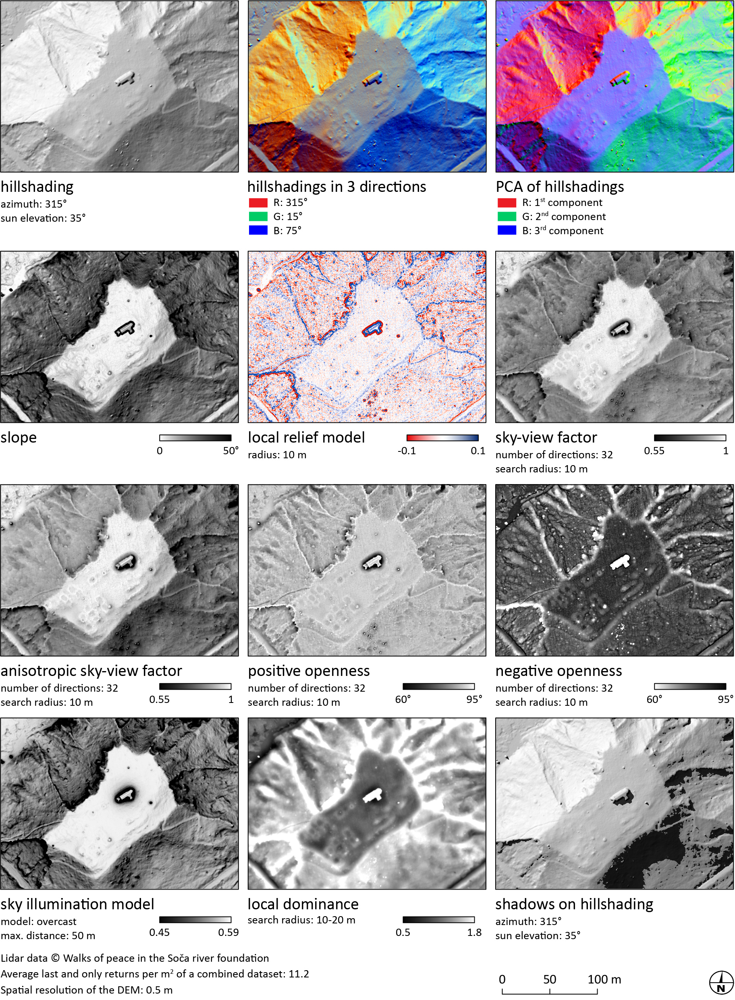

.. RVT QGIS Plugin documentation master file, created by
   sphinx-quickstart on Fri Dec 18 11:24:28 2020.
   You can adapt this file completely to your liking, but it should at least
   contain the root `toctree` directive.

Relief Visualization Toolbox QGIS Plugin
========================================

Relief Visualization Toolbox was produced to help scientist visualize raster elevation model datasets. We have narrowed down the selection to include techniques that have proven to be effective for identification of small scale features. Default settings therefore assume working with high resolution digital elevation models, derived from airborne laser scanning missions (lidar).

Despite this, techniques are also used for different other purposes. Sky-view factor, for example, can be efficiently used in numerous studies where digital elevation model visualizations and automatic feature extraction techniques are indispensable, e.g. in geography, archeology,  geomorphology, cartography, hydrology, glaciology, forestry and disaster management. It can be used even in engineering applications, such as, predicting the availability of the GPS signal in urban areas.

Methods currently implemented are:

*   hillshading,
*   hillshading from multiple directions,
*   slope gradient,
*   simple local relief model,
*   multi-scale relief model,
*   sky illumination,
*   sky-view factor (as developed by our team),
*   anisotropic sky-view factor,
*   positive and negative openness,
*   local dominance.

For a more detailed description see references given at each method in the manual and a comparative paper describing them.

RVT can be used as a QGIS plugin, ArcGIS raster functions or as a Python library.

References
----------

When using the tools, please cite:

*   Kokalj, Ž., Somrak, M. 2019. `Why Not a Single Image? Combining Visualizations to Facilitate Fieldwork and On-Screen Mapping <https://www.mdpi.com/2072-4292/11/7/747>`_. Remote Sensing 11(7): 747.
*   Zakšek, K., Oštir, K., Kokalj, Ž. 2011. `Sky-View Factor as a Relief Visualization Technique <https://www.mdpi.com/2072-4292/3/2/398>`_. Remote Sensing 3: 398-415.

Contributing
------------

The source code for Python library is available at  `GitHub EarthObservation/RVT_py <https://github.com/EarthObservation/RVT_py>`_. The source code for QGIS Plugin is available at  `GitHub EarthObservation/rvt-qgis <https://github.com/EarthObservation/rvt-qgis>`_. 

Pull requests are welcome. For major changes, please open an issue first to discuss what you would like to change.

Please report any bugs and suggestions for improvements.

Acknowledgment
--------------

Development of RVT Python scripts was part financed by the Slovenian Research Agency core funding No. P2-0406 and by research projects No. J6-9395 and J2-9251. Development of RVT QGIS plugin was part financed by PTS Consultancy via the UK Government Culture Recovery Fund.

Versions
--------

v 0.5.3
~~~~~~~

*   Multi-scale relief model and Sky illumination visualizations temporarily removed, because they don't work as they should. They will be fixed soon.

v 0.5.2
~~~~~~~

*   8-bit no data values changed from 0 to 255 (white).
*   Added from osgeo import gdal to default module.

v 0.5.1
~~~~~~~

*   Blender tab Blend images button position changed.

v 0.5.0
~~~~~~~

*   Added Other tab where you can cut-off raster values, normalize raster and change raster to 8 bit.
*   Plugin saves all output raster files as LZW compressed GeoTIFFs (previously it was saving without compression).

License
-------

This project is licensed under the terms of the `Apache License <http://www.apache.org/licenses/LICENSE-2.0>`_.

© Copyright 2020 Research Centre of the Slovenian Academy of Sciences and Arts (ZRC SAZU) and University of Ljubljana, Faculty of civil and geodetic engineering (UL FGG)

.. toctree::
   :maxdepth: 1
   :hidden:
   :caption: Contents:

   install
   usage
